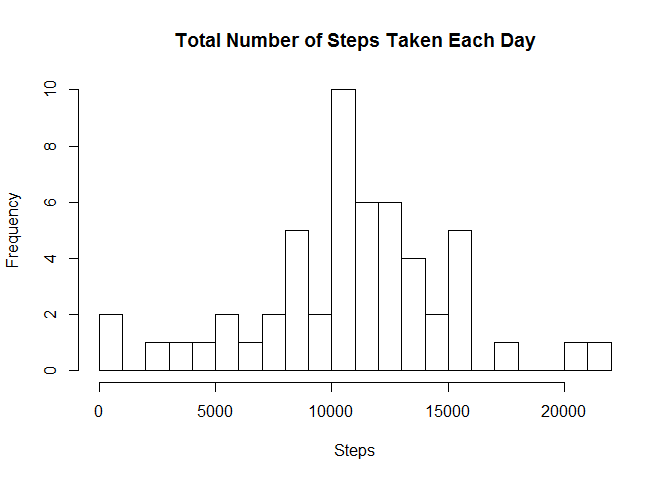
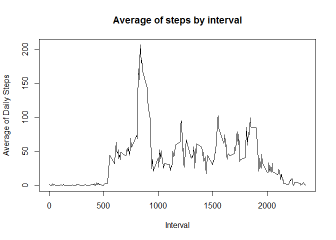
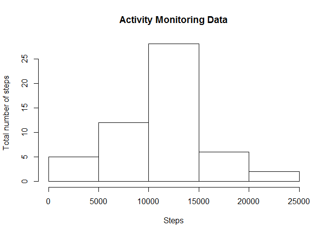
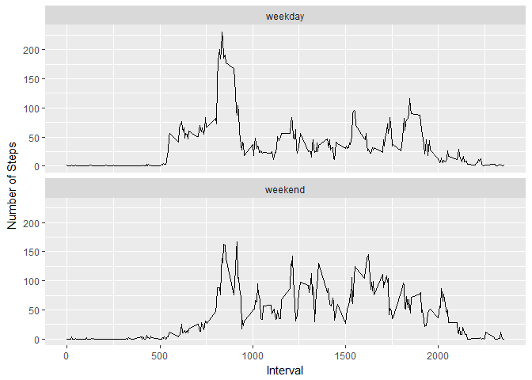

# Reproducible Research: Peer Assessment 1
## Data

The data for this assignment can be downloaded from the course web
site:

* Dataset: [Activity monitoring data](https://d396qusza40orc.cloudfront.net/repdata%2Fdata%2Factivity.zip) [52K]

The variables included in this dataset are:

* **steps**: Number of steps taking in a 5-minute interval (missing
    values are coded as `NA`)

* **date**: The date on which the measurement was taken in YYYY-MM-DD
    format

* **interval**: Identifier for the 5-minute interval in which
    measurement was taken

### Loading and preprocessing the data

Show any code that is needed to

1. Load the data (i.e. `read.csv()`)

2. Process/transform the data (if necessary) into a format suitable for your analysis


First, we will unzip the file

```r
        if (!file.exists("./activity.csv"))
                unzip("./activity.zip")
```
Now, load the data 

```r
        activityData <- read.csv("./activity.csv")
```
Let's explore data a bit

```r
        summary(activityData)
```

```
##      steps                date          interval     
##  Min.   :  0.00   2012-10-01:  288   Min.   :   0.0  
##  1st Qu.:  0.00   2012-10-02:  288   1st Qu.: 588.8  
##  Median :  0.00   2012-10-03:  288   Median :1177.5  
##  Mean   : 37.38   2012-10-04:  288   Mean   :1177.5  
##  3rd Qu.: 12.00   2012-10-05:  288   3rd Qu.:1766.2  
##  Max.   :806.00   2012-10-06:  288   Max.   :2355.0  
##  NA's   :2304     (Other)   :15840
```

```r
        head(activityData)
```

```
##   steps       date interval
## 1    NA 2012-10-01        0
## 2    NA 2012-10-01        5
## 3    NA 2012-10-01       10
## 4    NA 2012-10-01       15
## 5    NA 2012-10-01       20
## 6    NA 2012-10-01       25
```
### What is mean total number of steps taken per day?

For this part of the assignment, you can ignore the missing values in
the dataset.

1. Make a histogram of the total number of steps taken each day

2. Calculate and report the **mean** and **median** total number of steps taken per day

We will plot the total number of steps taken per day

```r
        library(dplyr)
```

```
## Warning: package 'dplyr' was built under R version 3.3.3
```

```
## 
## Attaching package: 'dplyr'
```

```
## The following objects are masked from 'package:stats':
## 
##     filter, lag
```

```
## The following objects are masked from 'package:base':
## 
##     intersect, setdiff, setequal, union
```

```r
        summedupData <- activityData %>% group_by(date) %>% summarise(totalSteps = sum(steps),na.rm=TRUE)
        hist(summedupData$totalSteps,breaks=20,main="Total Number of Steps Taken Each Day",
             xlab = "Steps")
```

<!-- -->


###Calculate mean and median of steps taken per day


```r
        meanSteps <- mean(summedupData$totalSteps, na.rm=TRUE)
        medianSteps <- median(summedupData$totalSteps, na.rm = TRUE)
        cat("Mean:",meanSteps, " Median: ", medianSteps)
```

```
## Mean: 10766.19  Median:  10765
```
### What is the average daily activity pattern?

1. Make a time series plot (i.e. `type = "l"`) of the 5-minute interval (x-axis) and the average number of steps taken, averaged across all days (y-axis)

2. Which 5-minute interval, on average across all the days in the dataset, contains the maximum number of steps?


```r
        averageDaily <- activityData %>% group_by(interval) %>% summarise(averageSteps =mean(steps,na.rm=TRUE))
         plot(x=averageDaily$interval, y=averageDaily$averageSteps, type="l", xlab= "Interval", ylab = "Average of Daily Steps", main= "Average of steps by interval")
```

<!-- -->

```r
         cat("Interval that contains the maximum number of steps :", averageDaily[which.max(averageDaily$averageSteps),]$interval)
```

```
## Interval that contains the maximum number of steps : 835
```

### Imputing missing values

Note that there are a number of days/intervals where there are missing
values (coded as `NA`). The presence of missing days may introduce
bias into some calculations or summaries of the data.

1. Calculate and report the total number of missing values in the dataset (i.e. the total number of rows with `NA`s)

2. Devise a strategy for filling in all of the missing values in the dataset. The strategy does not need to be sophisticated. For example, you could use the mean/median for that day, or the mean for that 5-minute interval, etc.

3. Create a new dataset that is equal to the original dataset but with the missing data filled in.

4. Make a histogram of the total number of steps taken each day and Calculate and report the **mean** and **median** total number of steps taken per day. Do these values differ from the estimates from the first part of the assignment? What is the impact of imputing missing data on the estimates of the total daily number of steps?


```r
        cat("Total number of rows with NAs :" ,sum(is.na(activityData$steps)))
```

```
## Total number of rows with NAs : 2304
```

```r
        meanByInterval <- aggregate(activityData$steps,by=activityData["interval"],FUN=mean,na.rm=TRUE)
        str(meanByInterval)
```

```
## 'data.frame':	288 obs. of  2 variables:
##  $ interval: int  0 5 10 15 20 25 30 35 40 45 ...
##  $ x       : num  1.717 0.3396 0.1321 0.1509 0.0755 ...
```

```r
       newactivityData <- merge(activityData,meanByInterval,by="interval")
       newactivityData[is.na(newactivityData$steps),]$steps <- newactivityData[is.na(newactivityData$steps),]$x
       newactivityData <- newactivityData[,-4]
```
Make a histogram of the total number of steps taken each day
 

```r
        summedUpByDay <- newactivityData%>% group_by(date) %>% summarise(totalSteps = sum(steps))
         hist(summedupData$totalSteps, type="h", xlab="Steps", ylab= "Total number of steps", main = "Activity Monitoring Data")
```

```
## Warning in plot.window(xlim, ylim, "", ...): graphical parameter "type" is
## obsolete
```

```
## Warning in title(main = main, sub = sub, xlab = xlab, ylab = ylab, ...):
## graphical parameter "type" is obsolete
```

```
## Warning in axis(1, ...): graphical parameter "type" is obsolete
```

```
## Warning in axis(2, ...): graphical parameter "type" is obsolete
```

<!-- -->

```r
         meanSteps <- mean(summedUpByDay$totalSteps)
         medianSteps <- median(summedUpByDay$totalSteps)
          cat("Mean:",meanSteps, " Median: ", medianSteps)
```

```
## Mean: 10766.19  Median:  10766.19
```

### Are there differences in activity patterns between weekdays and weekends?

For this part the `weekdays()` function may be of some help here. Use
the dataset with the filled-in missing values for this part.

1. Create a new factor variable in the dataset with two levels -- "weekday" and "weekend" indicating whether a given date is a weekday or weekend day.

1. Make a panel plot containing a time series plot (i.e. `type = "l"`) of the 5-minute interval (x-axis) and the average number of steps taken, averaged across all weekday days or weekend days (y-axis). The plot should look something like the following, which was created using **simulated data**:


Create a new factor variable with weekday or weekend
 

```r
         newactivityData$day <- ifelse(weekdays(as.Date(newactivityData$date)) == "Saturday" |                                   weekdays(as.Date(newactivityData$date)) == "Sunday", 
                                                         "weekend","weekday")
         summedUpByInterval <- newactivityData%>% group_by(day,interval) %>% summarise(MeanSteps = mean(steps))
          library(ggplot2)
```

```
## Warning: package 'ggplot2' was built under R version 3.3.3
```

```r
          qplot(interval, MeanSteps, data = summedUpByInterval,type="l",
                geom=c("line"),ylab="Number of Steps", xlab="Interval") + facet_wrap(~ day, ncol = 1)
```

```
## Warning: Ignoring unknown parameters: type
```

<!-- -->
